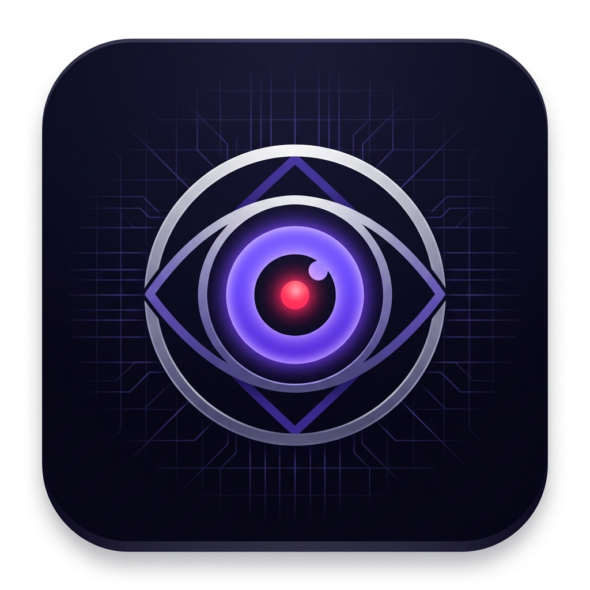

# dashcam

# 🎥 DashCam Monitor

A real-time dashcam motion detection system that sends instant notifications with photos to your Android phone over local WiFi — no internet required.



## ✨ Features

- 🚨 **Instant motion alerts** with snapshot photo
- 🔔 **Sound + vibration** notifications on Android
- 📱 **Works in Chrome browser** — no app install needed
- 📲 **Installable as Android app** from browser
- 🎯 **Adjustable sensitivity** via in-app settings
- 🔄 **Live camera feed** updated every 2 seconds
- 📸 **Alert history** with photos
- 🌐 **Local WiFi only** — no cloud, no internet needed

## 🛠 Requirements

- Windows PC with Python 3.8+
- Dashcam connected via USB (or WiFi/RTSP stream)
- Android phone on the same WiFi network
- Chrome browser on Android

## 🚀 Quick Start

### 1. Install Python
Download from [python.org](https://www.python.org/downloads/) — check **"Add Python to PATH"**

### 2. Start the Server
```bash
# Double-click start.bat on Windows
# OR run manually:
cd server
pip install -r requirements.txt
python app.py
```

### 3. Connect Android Phone
Open the URL shown in the terminal on your Android Chrome browser:
```
http://YOUR-PC-IP:5000
```

## ⚙️ Configuration

Edit `server/config.py`:

```python
# USB camera (default)
CAMERA_SOURCE = 0

# WiFi/IP camera
CAMERA_SOURCE = "rtsp://192.168.1.100:554/stream"

# Motion sensitivity (lower = more sensitive)
MOTION_THRESHOLD = 1500

# Seconds between alerts
ALERT_COOLDOWN_SECONDS = 5
```

## 📁 Project Structure

```
dashcam-monitor/
├── start.bat                 ← Double-click to start (Windows)
├── server/
│   ├── app.py                ← Flask + WebSocket server
│   ├── motion_detector.py    ← OpenCV motion detection
│   ← camera_manager.py     ← Camera connection handler
│   ├── config.py             ← All settings
│   └── requirements.txt      ← Python dependencies
└── client/                   ← Android PWA dashboard
    ├── index.html
    ├── style.css
    ├── app.js
    ├── sw.js                 ← Background notifications
    └── manifest.json         ← Installable as Android app
```

## 🔧 Troubleshooting

| Problem | Solution |
|---|---|
| Camera not found | Try `CAMERA_SOURCE = 1` in config.py |
| Phone can't connect | Check same WiFi, disable Windows Firewall |
| No sound on phone | Tap the screen once to unlock audio |
| Black feed | Close other apps using the camera |

## 📜 License

MIT License — free to use and modify.
